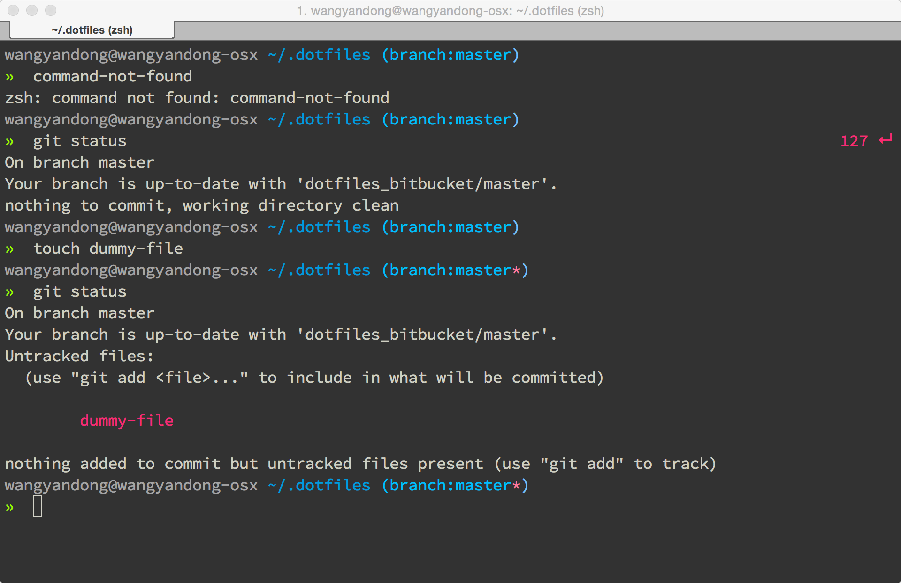

# ningxia.zsh-theme
My personal zsh theme based on ```af-magic.zsh-theme``` from [andyfleming/oh-my-zsh](https://github.com/andyfleming/oh-my-zsh). Putting it on Github will make it easier for [antigen](https://github.com/zsh-users/antigen) to manage the theme.


## Screenshots



## Usage

	antigen use oh-my-zsh
	antigen theme wangyandong-ningxia/ningxia.zsh-theme ningxia